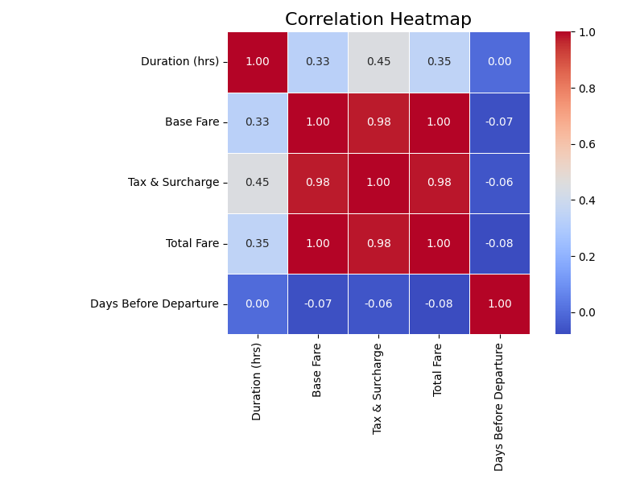
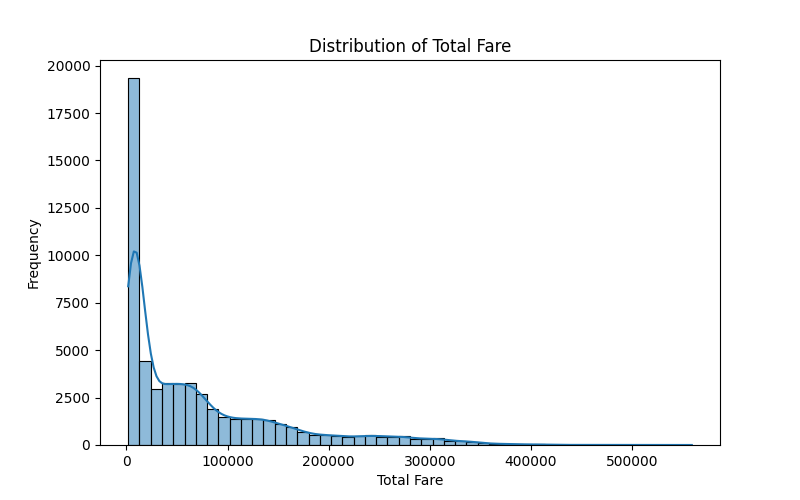
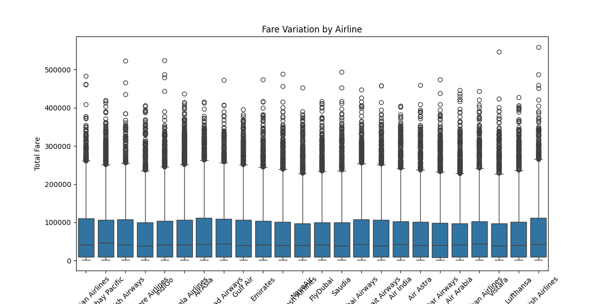
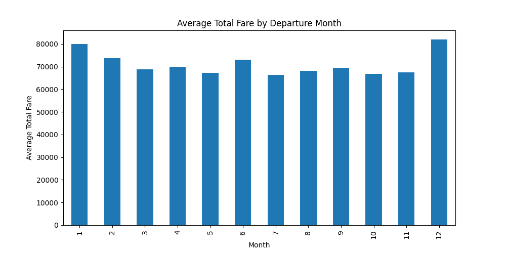
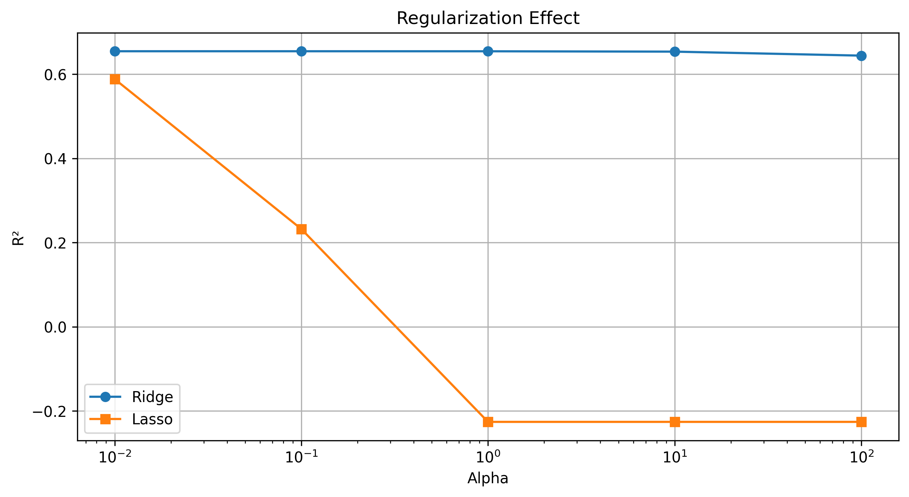
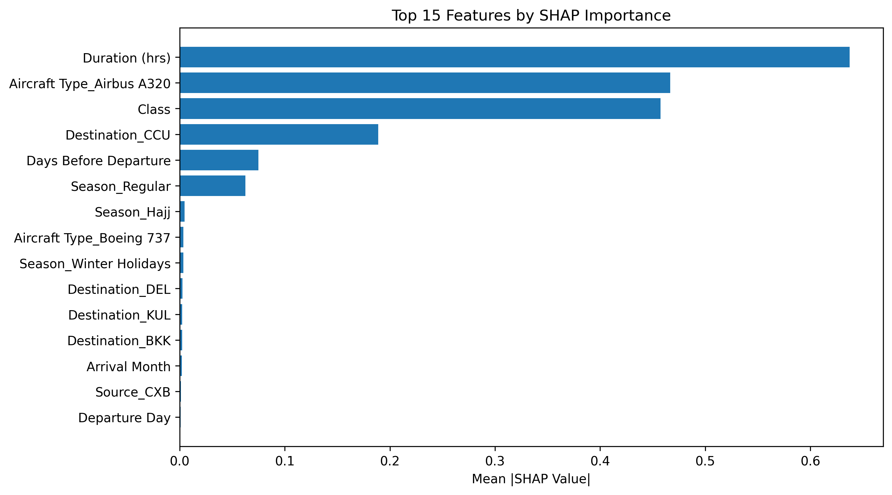

# Flight Fare Prediction Using Machine Learning

## Project Overview

This project implements an **end-to-end Machine Learning pipeline** for predicting flight fares based on airline, route, seasonal trends, and travel timing features.

It covers the full data science lifecycle:

* Business Problem Framing
* Data Cleaning & Validation
* Exploratory Data Analysis (EDA)
* Feature Engineering
* Model Training & Optimization
* Model Interpretation (SHAP)
* Model Deployment (Frontend + Backend API)

The final selected model is a **Gradient Boosting Regressor**, optimized using cross-validation.

---

# Project Structure

```
├── app/
│   ├── frontend.py
│   └── backend.py
│
├── modelling/
│   ├── data/
│   ├── logs/
│   ├── outputs/
│   │   ├── models/
│   │   ├── plots/
│   │   ├── model_comparison.csv
│   │   └── shap_importance.csv
│
├── notebooks/
├── data-assumption.md
├── key-finding.md
├── main.py
├── requirements.txt
└── README.md
```

---

# Business Problem

Airlines and travel platforms need accurate fare predictions to:

* Optimize dynamic pricing
* Improve customer recommendations
* Forecast revenue trends
* Understand seasonal demand patterns

This project frames fare prediction as a:

> **Supervised Regression Problem**
> Target Variable: `Total Fare`

---

#  Dataset Summary

* **Rows:** 57,000
* **Original Features:** 17
* **Engineered Features:** 74
* **Train/Test Split:** 80/20

  * Train: 45,600
  * Test: 11,400

---

#  Data Cleaning & Validation

✔ All required columns validated
✔ Date features extracted (Month, Day, Season)
✔ One-hot encoding applied
✔ Ordinal encoding applied
✔ Removed target leakage (Base Fare & Tax removed)
✔ Feature scaling applied

---

#  Exploratory Data Analysis (EDA)

## Correlation Matrix



**Observation:**

* Base Fare highly correlated with Total Fare (0.99)
* Tax & Surcharge strongly correlated (0.98)
* Days Before Departure weak negative relationship

---

## Total Fare Distribution



**Insight:**

* Right-skewed distribution
* Presence of high-price outliers

---

##  Fare Variation by Airline



**Highest Average Fare:**

* Turkish Airlines (~75,547)

**Lowest Among Major Airlines:**

* Air Astra (~68,497)

---

##  Seasonal Fare Variation



### Average Fare by Season

| Season          | Avg Fare |
| --------------- | -------- |
| Hajj            | 97,144   |
| Eid             | 91,560   |
| Winter Holidays | 79,676   |
| Regular         | 68,077   |

**Insight:** Religious and holiday seasons significantly increase fares.

---

##  Top 5 Most Expensive Routes

| Route     | Avg Fare |
| --------- | -------- |
| SPD → BKK | 117,951  |
| CXB → YYZ | 117,848  |
| CXB → LHR | 116,667  |
| CXB → JFK | 116,476  |
| BZL → JFK | 115,968  |

---

# Model Development

## Models Evaluated

| Model                 | R²         | MAE        | RMSE       |
| --------------------- | ---------- | ---------- | ---------- |
| Linear Regression     | 0.6546     | 28,515     | 47,985     |
| Ridge                 | 0.6546     | 28,516     | 47,985     |
| Lasso                 | -0.1884    | 56,294     | 89,005     |
| Decision Tree         | 0.3295     | 37,877     | 66,854     |
| Random Forest         | 0.6368     | 28,963     | 49,205     |
| **Gradient Boosting** | **0.6561** | **28,464** | **47,880** |

---

#  Best Model: Gradient Boosting

### Best Parameters

```
learning_rate = 0.1
max_depth = 3
n_estimators = 100
```

### Cross-Validation Score

```
CV R² = 0.8937
```

### Final Performance

| Metric    | Value  |
| --------- | ------ |
| Train R²  | 0.6628 |
| Test R²   | 0.6561 |
| Test MAE  | 28,464 |
| Test RMSE | 47,880 |

✔ Minimal overfitting
✔ Strong generalization
✔ Best bias-variance balance

---

# Regularization Analysis



**Findings:**

* Ridge stabilized coefficients
* Lasso over-penalized and underfit
* Gradient Boosting outperformed regularized linear models

---

# SHAP Model Interpretation

## SHAP Feature Importance



### Top Influential Features:

* Duration
* Route
* Season
* Airline
* Days Before Departure

**Key Insight:**
Flight duration and route contribute more than timing features.

---

# Additional KPI & Analytical Visualizations

### Outlier Detection

(Add outlier plot here)

```


```

###  Model Comparison Plot

```

```

### Predicted vs Actual

```

```

---

# Model Artifacts

Saved under:

```
modelling/outputs/models/
```

Artifacts:

* `flight_price_model.pkl`
* `scaler.pkl`
* `feature_columns.pkl`

These are used in the backend API for live predictions.

---

# Application Layer

## Backend

* FastAPI-based API
* Loads trained model
* Accepts JSON request
* Returns predicted fare

## Frontend

* User-friendly interface
* Collects flight details
* Displays predicted fare

---

# Pipeline Summary

```
Rows Processed: 57,000
Features Engineered: 74
Best Model: GradientBoostingRegressor
Model Saved: Yes
Logs Generated: Yes
Plots Generated: Yes
SHAP Computed: Yes
```

---

# Key Business Insights

* Religious and holiday seasons drive fare increases.
* Long-haul routes significantly increase price.
* Airline brand impacts pricing strategy.
* Booking timing has moderate but not dominant impact.
* Tree-based ensemble models outperform linear methods.

---

#  Technologies Used

* Python
* Pandas
* NumPy
* Scikit-Learn
* SHAP
* Matplotlib / Seaborn
* FastAPI
* Joblib

---

# Future Improvements

* Implement Airflow DAG for orchestration
* Add model monitoring
* Add drift detection
* Deploy to cloud (Docker + CI/CD)
* Add real-time fare streaming pipeline

---

# Conclusion

This project demonstrates:

✔ Full ML lifecycle implementation
✔ Proper validation & feature engineering
✔ Model comparison and optimization
✔ Interpretability using SHAP
✔ Deployment-ready artifacts

It serves as a production-style machine learning system for airline fare prediction.

---

**Author:** Jeremiah Anku
**Project Type:** End-to-End Machine Learning Pipeline
**Model:** Gradient Boosting Regressor
